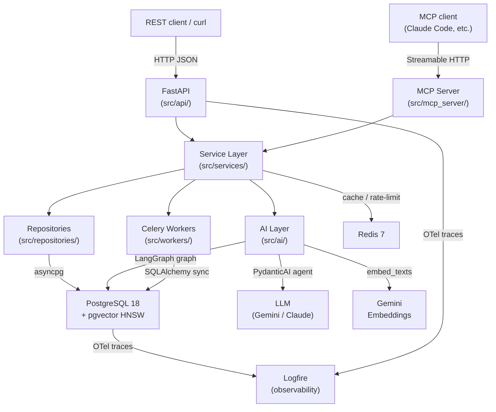

# Knowledge Platform

[](https://github.com/Serafim-Yablonski/KnowledgePlatform/actions/workflows/ci.yml)

AI-powered multi-tenant knowledge platform: a REST API plus an **MCP server** so AI agents can query it directly, a **LangGraph autonomous research workflow** with PostgreSQL crash recovery, and a **RAG eval harness** that proves retrieval works — not just that it runs.

Built to demonstrate senior Python backend patterns: layered architecture, `typing.Protocol`-based repositories, **provider-agnostic PydanticAI agents** (swap Gemini ↔ Claude with one env-var change), async FastAPI + Celery, and end-to-end OpenTelemetry tracing.

## What this demonstrates

| Pattern | Where |
|---|---|
| Layered architecture (routes → services → repositories → DB) | `src/api/`, `src/services/`, `src/repositories/` |
| Repository pattern with `typing.Protocol` interfaces | `src/repositories/protocols.py` |
| Async-first FastAPI (asyncpg) with Celery offload for CPU-bound work | `src/core/database.py`, `src/workers/` |
| RAG pipeline with eval harness (precision, recall, faithfulness, MRR) | `src/ai/eval/`, `evals/` |
| Provider-agnostic AI via PydanticAI (`LLM_MODEL` env var) | `src/ai/agents/`, `src/core/config.py` |
| LangGraph agentic research workflow with PostgreSQL crash recovery | `src/ai/graphs/` |
| MCP protocol adapter sharing the service layer with REST | `src/mcp_server/` |
| Sliding-window rate limiting via Redis | `src/core/rate_limit.py` |
| Multi-stage Docker build, uv lockfile, GitHub Actions CI | `Dockerfile`, `.github/workflows/` |
| End-to-end OpenTelemetry tracing exported to Logfire | `src/core/observability.py` |

## Architecture



## Tech stack

| Layer | Technology                                                                 |
|---|----------------------------------------------------------------------------|
| Language | Python 3.14                                                                |
| Web framework | FastAPI 0.136+ with Pydantic v2                                            |
| Database | PostgreSQL 18 + pgvector 0.8 (HNSW index)                                  |
| ORM / migrations | SQLAlchemy 2.0 async, asyncpg, Alembic                                     |
| AI agents | PydanticAI 1.89 (`output_type`, `deps_type`, `TestModel`)                  |
| Workflow orchestration | LangGraph 1.1 with `AsyncPostgresSaver` checkpointer                       |
| Embeddings | Google Gemini `gemini-embedding-001` (768 dims, Redis-cached)                |
| LLM (`LLM_MODEL`) | `google-gla:gemini-2.5-flash-lite` — configurable to any PydanticAI provider:model |
| Strong LLM (`LLM_STRONG_MODEL`) | `google-gla:gemini-2.5-flash` (eval judge) — swap to `anthropic:claude-*` with one env change |
| Background tasks | Celery 5 + Redis 7                                                         |
| Protocol adapter | MCP Python SDK 1.27 (Streamable HTTP)                                      |
| Observability | OpenTelemetry SDK + Pydantic Logfire                                       |
| Logging | structlog (structured JSON, trace_id on every line)                        |
| Package manager | uv                                                                         |
| Containerisation | Docker (multi-stage), Docker Compose                                       |
| CI | GitHub Actions                                                             |

## Quick start

```bash
git clone https://github.com/Serafim-Yablonski/KnowledgePlatform
cd KnowledgePlatform
cp .env.example .env
```

Edit `.env` and set your API keys. The system uses **three model roles**, each set independently:

| Role | Env var | Default | Purpose |
|---|---|---|---|
| Embeddings | `EMBEDDING_MODEL` | `gemini-embedding-001` | Always Google — required for document indexing and search |
| Standard LLM | `LLM_MODEL` | `google-gla:gemini-2.5-flash-lite` | Q&A and research iterations |
| Strong LLM | `LLM_STRONG_MODEL` | `google-gla:gemini-2.5-flash` | Eval judge and heavy synthesis |

**`GOOGLE_API_KEY` is always required** — embeddings are always Gemini, and both LLMs default to Gemini too. The stack runs fully with this key alone.

**`ANTHROPIC_API_KEY` is optional** — set it to unlock Claude for `LLM_MODEL` and/or `LLM_STRONG_MODEL`. Then change those vars in `.env`, e.g.:

```
LLM_MODEL=anthropic:claude-haiku-4-5
LLM_STRONG_MODEL=anthropic:claude-sonnet-4-6
```

No code changes needed — PydanticAI routes to the right provider based on the `provider:model` prefix.

Also set `SECRET_KEY` to a random value:

```bash
openssl rand -hex 32   # paste the output into SECRET_KEY in .env
```

Then start the stack:

```bash
make run          # docker compose up (app + postgres + redis + celery worker)
```

Once the stack is running:

- **API docs**: http://localhost:8000/docs
- **Health check**: http://localhost:8000/health

### Connect an MCP client

```bash
make mcp-config   # creates an API key and prints ready-to-paste config for Claude Desktop / Cursor
```

This calls the running API to create a key, then prints the exact JSON block to add to your MCP client config (`~/Library/Application Support/Claude/claude_desktop_config.json` on macOS). After that, Claude Code and Claude Desktop can call `search_documents`, `ask_question`, and `run_research` as native tools.

## API documentation

FastAPI auto-generates interactive docs at `/docs` (Swagger UI) and `/redoc`. The full API surface:

| Resource | Operations |
|---|---|
| `POST /api/v1/auth/register` | Register a new user |
| `POST /api/v1/auth/token` | Obtain a JWT access token |
| `GET/POST /api/v1/workspaces` | List or create workspaces |
| `POST /api/v1/workspaces/{id}/documents` | Upload a document (triggers async embedding) |
| `GET /api/v1/workspaces/{id}/documents` | List documents (cursor-paginated) |
| `POST /api/v1/workspaces/{id}/search` | Semantic search over embedded chunks |
| `POST /api/v1/workspaces/{id}/ai/ask` | Answer a question using RAG + PydanticAI agent |
| `POST /api/v1/workspaces/{id}/research` | Start a LangGraph multi-step research workflow |
| `GET /api/v1/workspaces/{id}/research/{thread_id}` | Check research status |
| `POST /api/v1/workspaces/{id}/research/{thread_id}/approve` | Human-in-the-loop approval |
| `GET /api/v1/workspaces/{id}/research/{thread_id}/stream` | SSE stream of synthesis tokens |

## Eval harness

The RAG evaluation harness is the most differentiating feature of this project — it proves the retrieval pipeline works, not just that it runs.

### What it measures

- **Retrieval precision@k**: fraction of retrieved chunks that are relevant
- **Retrieval recall**: fraction of relevant chunks that are retrieved
- **Mean reciprocal rank (MRR)**: how high the first relevant result ranks
- **Negative rejection rate**: fraction of "no answer" cases correctly refused (hallucination resistance)
- **Answer faithfulness**: judge LLM scores the answer against the source chunks

### How to run

```bash
# Run evaluation against the golden dataset (requires GOOGLE_API_KEY + ANTHROPIC_API_KEY)
make eval

# Compare current results against the saved baseline — exits non-zero on regression
make eval-compare

# Promote current results to the new baseline
make eval-baseline
```

### Golden dataset

`evals/golden_dataset.json` contains query–answer pairs with known relevant chunk IDs. At least 10 % of cases are negative (the answer is NOT in the documents) to stress-test hallucination resistance. Add new cases with the `/add-eval-cases` skill in Claude Code.

## Project structure

```
src/
  api/             # FastAPI routers — thin, delegates to services immediately
  schemas/         # Pydantic v2 request/response models (API boundary only)
  services/        # Business logic — orchestrates repositories, never touches DB directly
  repositories/    # Data access — async SQLAlchemy queries, typed with Protocol classes
  models/          # SQLAlchemy ORM models (DB schema source of truth)
  domain/          # Shared value objects, enums, business invariants
  core/            # Config, security, exceptions, middleware, dependencies
  workers/         # Celery tasks (text extraction, embedding generation)
  ai/              # PydanticAI agents, LangGraph graphs, chunking, eval harness
  mcp_server/      # MCP protocol adapter — imports from services/, never duplicates logic
tests/
  unit/            # Service tests with mocked repositories (Protocol stubs)
  integration/     # Repository tests against real PostgreSQL 18 via testcontainers
  api/             # Full-stack API tests with httpx.AsyncClient
  ai/              # Agent and graph tests with PydanticAI TestModel
evals/             # Golden datasets (.json) and eval result snapshots
docs/decisions/    # Architecture Decision Records (ADRs)
scripts/           # Dev utilities (trace demo, MCP config generator)
```

## Observability

Every `/ask` request produces a trace covering:

```
FastAPI middleware → auth check → rate_limit_check → ai_ask
  → pydantic_ai.agent.run
      → search_documents (tool call)
          → search  [query_hash, result_count, top_score, search_latency_ms]
              → embed_texts  [model, cache_hits, cache_misses, api_latency_ms]
              → asyncpg.execute  (SQL + bind params)
      → LLM completion  [model, prompt_tokens, completion_tokens]
  → response  [answer_length, confidence, source_count, tool_calls_count]
```

To generate traces manually:

```bash
make run           # start the stack first
make trace-demo    # seed data, ask a question, start research
# Then visit https://logfire.pydantic.dev/ (requires LOGFIRE_TOKEN in .env)
# Without LOGFIRE_TOKEN, traces print to the console.
```

## ADR index

| # | Decision | Summary |
|---|---|---|
| [001](docs/decisions/001-exception-hierarchy.md) | Custom exception hierarchy | `AppError` base class decouples service errors from HTTP transport |
| [002](docs/decisions/002-async-everywhere.md) | Async everywhere | asyncpg for app queries; psycopg3 exclusively for LangGraph checkpointer |
| [003](docs/decisions/003-repository-protocols.md) | Repository protocols | Services depend on `typing.Protocol`, not SQLAlchemy implementations |
| [004](docs/decisions/004-multi-tenancy-workspace.md) | Multi-tenancy via workspaces | Row-level isolation; every query scoped to `workspace_id` |
| [005](docs/decisions/005-cursor-pagination.md) | Cursor-based pagination | `(created_at, id)` composite cursor; no OFFSET |
| [006](docs/decisions/006-logfire-observability.md) | Logfire over self-hosted Jaeger | Standard OTel instrumentation; swap exporter without code changes |
| [007](docs/decisions/007-celery-sync-db.md) | Celery sync DB engine | Separate `create_engine` (psycopg3 sync) for Celery workers |
| [008](docs/decisions/008-embedding-provider.md) | Embedding provider & cache | Gemini `gemini-embedding-001`; Redis 24-hour cache keyed on model+dims |
| [009](docs/decisions/009-sliding-window-rate-limit.md) | Sliding-window rate limiting | Redis sorted-set implementation; no fixed-window burst |
| [010](docs/decisions/010-pydanticai-over-langchain.md) | PydanticAI over LangChain | Typed deps injection, `TestModel` for zero-API-call tests |
| [011](docs/decisions/011-langgraph-checkpointer.md) | LangGraph PostgreSQL checkpointer | `AsyncPostgresSaver` for crash recovery; Redis pub/sub for SSE streaming |
| [012](docs/decisions/012-mcp-shared-services.md) | MCP as protocol adapter | MCP server shares service layer with REST; zero logic duplication |
| [013](docs/decisions/013-mcp-api-key-auth.md) | MCP API key auth | API key for local demo; pure ASGI middleware avoids SSE buffering |
| [014](docs/decisions/014-pgvector-hnsw.md) | pgvector HNSW over IVFFlat | No training step needed; correct results on freshly seeded workspaces |
| [015](docs/decisions/015-docker-multistage.md) | Docker multi-stage build | Runtime image contains no build tools; uv lockfile is source of truth |
