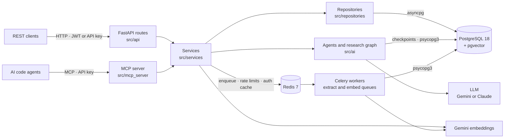

# Knowledge Platform

[](https://github.com/Serafim-Yablonski/KnowledgePlatform/actions/workflows/ci.yml)

Knowledge Platform lets teams upload documents into isolated workspaces, search them semantically and ask questions about them (RAG), from REST clients or directly from AI code agents over the Model Context Protocol (MCP). Uploads are validated, then chunked and embedded by Celery workers; search runs on PostgreSQL with pgvector. REST and MCP are thin adapters over the same services. A multi-step research agent plans queries, gathers evidence until it is sufficient, and streams a synthesised report.

The emphasis is on correctness you can check: layer rules enforced by import-linter, `mypy --strict`, ~700 tests against real PostgreSQL 18 (testcontainers, failure paths with injected faults), and 24 architecture decision records that name the alternatives they rejected. Each highlight below links to the test or ADR that proves it.

## Highlights

- **MCP server for code agents.** MCP SDK 2.x, serving only the stateless 2026-07-28 protocol, so identity travels with every request. Retrieval-first tools (`list_workspaces`, `search_documents`, `list_documents`, `read_document`) with typed outputs and effect annotations; Origin is checked before authentication. Tested through the real SDK client, including two users and concurrent callers who each see only their own data. [ADR-021](docs/decisions/021-mcp-sdk2-handshake-free.md), [ADR-023](docs/decisions/023-mcp-retrieval-first-tools.md), [tests](tests/integration/test_mcp_protocol.py)
- **One service layer, enforced.** Routes → services → repositories, assembled in a single composition root. Import-linter contracts forbid building repositories anywhere else and keep services, repositories and domain free of FastAPI/Starlette. [ADR-018](docs/decisions/018-composition-root.md), [contracts](pyproject.toml)
- **Workspace isolation.** Role-based permissions (owner, admin, member, viewer); every workspace-scoped query filters by workspace, and non-members are refused at the service, REST and MCP layers. [ADR-004](docs/decisions/004-multi-tenancy-workspace.md), [REST tests](tests/api/test_documents.py), [MCP tests](tests/integration/test_mcp_server.py)
- **Background document processing.** Separate Celery queues for CPU-bound extraction and I/O-bound embedding, scaled independently. Late acknowledgement, retries with backoff and jitter, time limits; a redelivered message doesn't redo finished work, and version-checked writes discard stale chunks. [task tests](tests/integration/test_embed_chunks_task.py), [extraction tests](tests/integration/test_extract_text.py), [config tests](tests/unit/test_celery_config.py)
- **Cursor pagination.** Composite `(created_at, id)` cursor, no OFFSET; pages stay stable while rows are inserted. [ADR-005](docs/decisions/005-cursor-pagination.md), [tests](tests/integration/test_document_repository.py)
- **Sliding-window rate limiting.** Redis sorted sets, `Retry-After` and RateLimit headers, fail-open or fail-closed chosen per route. [ADR-009](docs/decisions/009-sliding-window-rate-limit.md), [tests](tests/unit/test_rate_limiter.py)
- **Authentication.** JWT for users; API keys for agents, stored as SHA-256 hashes, with `last_used_at` writes throttled through Redis. Membership and API-key lookups are cached in Redis and invalidated on write. [ADR-019](docs/decisions/019-api-key-last-used-throttle.md)
- **Model-agnostic agents.** PydanticAI agents with typed, validated outputs; the LLM is a `provider:model` setting (Gemini or Claude). Agent and graph tests run without API calls (`TestModel`). [ADR-010](docs/decisions/010-pydanticai-over-langchain.md), [tests](tests/ai/)
- **Observability with a trust boundary.** OpenTelemetry traces exported to Logfire from both the API and the workers; an upload's trace continues into its Celery tasks. The API ignores trace context sent by clients, the worker trusts only our broker, and traced embedding calls never carry the API key. [ADR-020](docs/decisions/020-trace-context-trust.md), [tests](tests/unit/test_observability.py)
- **Upload validation.** Content checks, server-generated file names on disk, and cleanup after a failed write. [failure tests](tests/integration/test_document_upload_failures.py)

## Architecture


```mermaid
graph LR
    REST["REST clients"] -->|HTTP · JWT or API key| API["FastAPI routes<br/>src/api"]
    AGENT["AI code agents"] -->|MCP · API key| MCP["MCP server<br/>src/mcp_server"]
    API --> SVC["Services<br/>src/services"]
    MCP --> SVC
    SVC --> REPO["Repositories<br/>src/repositories"]
    SVC --> AI["Agents and research graph<br/>src/ai"]
    REPO -->|asyncpg| PG[("PostgreSQL 18<br/>+ pgvector")]
    AI -->|checkpoints · psycopg3| PG
    AI --> LLM["LLM<br/>Gemini or Claude"]
    SVC --> EMB["Gemini embeddings"]
    SVC -->|enqueue · rate limits · auth cache| REDIS[("Redis 7")]
    REDIS --> W["Celery workers<br/>extract and embed queues"]
    W -->|psycopg3| PG
    W --> EMB
```

Services, repositories and agents are built only in `src/composition.py`. The API and the workers export traces to Logfire.

## Tech stack

| Layer | Technology |
|---|---|
| Language | Python 3.14 |
| Web | FastAPI 0.136, Pydantic v2 |
| Database | PostgreSQL 18 + pgvector (HNSW index), SQLAlchemy 2.0 async (asyncpg), Alembic |
| Background jobs | Celery 5.6, Redis 7 |
| AI | PydanticAI 1.89, LangGraph 1.1 (`AsyncPostgresSaver`), Gemini `gemini-embedding-001` (768 dims) |
| MCP | MCP Python SDK 2.3 (Streamable HTTP, protocol 2026-07-28) |
| Observability | OpenTelemetry + Logfire, structlog (JSON logs with trace and span ids) |
| Tooling | uv, ruff, mypy `--strict`, import-linter, pytest + testcontainers |
| Delivery | Docker (multi-stage, non-root), Docker Compose, GitHub Actions |

## Quick start

Requires Docker and a Google AI API key.

```bash
git clone https://github.com/Serafim-Yablonski/KnowledgePlatform
cd KnowledgePlatform
cp .env.example .env   # set GOOGLE_API_KEY, and SECRET_KEY to the output of: openssl rand -hex 32
make migrate           # starts Postgres and applies the migrations
make run               # API + MCP, two Celery workers, Postgres, Redis
```

- API docs: http://localhost:8000/docs
- Health (Postgres, Redis, Celery workers): http://localhost:8000/health

Models are set in `.env`:

| Role | Variable | Default |
|---|---|---|
| Embeddings (Gemini only) | `EMBEDDING_MODEL` | `gemini-embedding-001` |
| Questions, research steps | `LLM_MODEL` | `google-gla:gemini-3.5-flash-lite` |
| Research synthesis | `LLM_STRONG_MODEL` | `google-gla:gemini-3.8-flash` |

To use Claude, set `ANTHROPIC_API_KEY` and e.g. `LLM_MODEL=anthropic:claude-haiku-5-5`; no code changes.

### Connect an MCP client

```bash
make mcp-config   # creates an API key and prints how to connect a client
```

It prints the `claude mcp add` command for Claude Code, plus the URL (`http://localhost:8000/mcp`) and `Authorization` header for any other client. The server speaks only the handshake-free protocol (2026-07-28 and later); clients on older, session-based revisions are refused with the spec's errors. Question answering stays REST-only: an MCP client is already an LLM, so it gets the evidence rather than a second model's answer.

## REST API

Interactive docs at `/docs`. All workspace routes require membership.

| Endpoint | Purpose |
|---|---|
| `POST /api/v1/auth/register`, `/login`, `/refresh`; `GET /me` | Users and JWT tokens |
| `POST/GET /api/v1/auth/api-keys`, `DELETE /api-keys/{id}` | API keys for MCP clients |
| `POST/GET /api/v1/workspaces`, `GET/PATCH/DELETE /{id}` | Workspaces |
| `POST/GET /api/v1/workspaces/{id}/members`, `DELETE /members/{user_id}` | Membership |
| `POST/GET /api/v1/workspaces/{id}/documents`, `GET/PATCH/DELETE /{document_id}` | Upload (processed in the background), list (cursor-paginated), manage |
| `POST /api/v1/workspaces/{id}/search` | Semantic search |
| `POST /api/v1/workspaces/{id}/ai/ask` | RAG answer with sources and confidence |
| `POST /api/v1/workspaces/{id}/ai/research`, `GET /{thread_id}`, `GET /{thread_id}/stream` | Research agent: start, status, SSE stream of the report |

## Tests and CI

```bash
make ci         # ruff, import-linter, mypy --strict, full test suite with an 85% coverage gate
make test-int   # integration tests only (needs Docker)
```

Integration tests run against PostgreSQL 18 + pgvector in testcontainers, never SQLite; failure paths that touch the database or the broker are tested with injected faults. GitHub Actions runs lint (ruff, import-linter), type checking, unit, integration, API and AI test jobs in parallel, combines their coverage behind the same 85% gate, and builds the Docker image and checks that it starts against real Postgres and Redis. Actions are pinned to commit SHAs and the workflow token is read-only.

## Observability

Every request is traced. An `/ai/ask` request, for example:

```
POST /api/v1/workspaces/{id}/ai/ask                 FastAPI
└─ ai_ask        question_length, answer_length, confidence, source_count, tool_calls_count, gen_ai.usage.*
   ├─ search     query_hash, top_k, min_score, result_count, top_score, search_latency_ms
   │  ├─ embed_texts   model, dimensions, embedding_batch_size, embedding_api_duration_ms
   │  └─ asyncpg query
   └─ LLM HTTP calls (httpx)
```

Set `LOGFIRE_TOKEN` in `.env` to export to Logfire; without it nothing is exported.

## Status and roadmap

Working and tested: everything under Highlights. In progress:

- **Durable research.** Run the research graph in Celery, resumable from its Postgres checkpoints, with human approval of the research plan before retrieval and a structured report with validated citations; then expose it as MCP tools. Today it runs in-process: a crashed run is not resumed. [ADR-011](docs/decisions/011-langgraph-checkpointer.md)
- **Self-healing document pipeline.** A reconciler, so every upload reaches `INDEXED` or `FAILED` despite worker crashes or lost broker messages; failure reasons; a re-index command.
- **Retrieval evaluation.** Chunk-level ground truth stored as answer spans, on a corpus with overlapping topics, used to choose the chunk size and score threshold. [ADR-024](docs/decisions/024-remove-eval-harness.md)
- **Abuse and cost controls.** A request body limit before uploads are buffered, per-user cost limits.

## Project structure

```
src/
  api/            REST routes (thin: validate, call a service, return a schema)
  mcp_server/     MCP server, auth middleware, tools
  composition.py  the only place repositories and services are built
  services/       business logic, framework-free
  repositories/   SQLAlchemy queries behind typing.Protocol interfaces
  domain/         value objects and enums
  models/         ORM models
  schemas/        REST request and response models
  ai/             PydanticAI agents, LangGraph research graph, chunking, embeddings
  workers/        Celery app and tasks (extract, embed)
  core/           config, security, rate limiting, logging, observability
tests/            unit/, integration/ (testcontainers), api/, ai/
docs/decisions/   architecture decision records
```

## Architecture decision records

| # | Decision | Summary |
|---|---|---|
| [001](docs/decisions/001-exception-hierarchy.md) | Exception hierarchy | Services raise `AppError` subclasses; one handler maps them to HTTP |
| [002](docs/decisions/002-async-everywhere.md) | Database drivers | asyncpg for the application; psycopg3 for the LangGraph checkpointer and Celery workers; never psycopg2 |
| [003](docs/decisions/003-repository-protocols.md) | Repository protocols | Services depend on `typing.Protocol`, not SQLAlchemy implementations |
| [004](docs/decisions/004-multi-tenancy-workspace.md) | Multi-tenancy via workspaces | Row-level isolation; every query scoped to `workspace_id` |
| [005](docs/decisions/005-cursor-pagination.md) | Cursor pagination | `(created_at, id)` composite cursor; no OFFSET |
| [006](docs/decisions/006-logfire-observability.md) | Logfire over self-hosted Jaeger | Standard OTel instrumentation; another backend needs the exporter and a dozen direct `logfire` calls changed |
| [007](docs/decisions/007-celery-sync-db.md) | Celery sync DB engine | Workers use their own synchronous psycopg3 engine |
| [008](docs/decisions/008-embedding-provider.md) | Embedding provider | Gemini embeddings over raw `httpx`; the Redis cache it describes is not implemented |
| [009](docs/decisions/009-sliding-window-rate-limit.md) | Sliding-window rate limiting | Redis sorted sets; no fixed-window bursts |
| [010](docs/decisions/010-pydanticai-over-langchain.md) | PydanticAI over LangChain | Typed dependency injection, `TestModel` for tests without API calls |
| [011](docs/decisions/011-langgraph-checkpointer.md) | LangGraph Postgres checkpointer | `AsyncPostgresSaver`; Redis pub/sub for SSE. Crash recovery not yet true (see roadmap) |
| [012](docs/decisions/012-mcp-shared-services.md) | MCP as a protocol adapter | MCP shares the service layer with REST; no duplicated logic |
| [013](docs/decisions/013-mcp-api-key-auth.md) | MCP API-key auth | *Superseded by 021* (the API-key decision stands) |
| [014](docs/decisions/014-pgvector-hnsw.md) | pgvector HNSW over IVFFlat | No training step; correct results on new workspaces |
| [015](docs/decisions/015-docker-multistage.md) | Multi-stage Docker build | Runtime image has no build tools; uv lockfile is the source of truth |
| [016](docs/decisions/016-search-cache-invalidation.md) | Search cache invalidation | *Stale*: no search-result cache exists today |
| [017](docs/decisions/017-orm-objects-at-api-boundary.md) | ORM objects at the API boundary | Routes return response schemas; relationships are eager-loaded |
| [018](docs/decisions/018-composition-root.md) | One composition root | `src/composition.py` alone builds repositories and services |
| [019](docs/decisions/019-api-key-last-used-throttle.md) | API-key last-used throttle | `last_used_at` written at most once per key per 5 minutes; failures never block a request |
| [020](docs/decisions/020-trace-context-trust.md) | Trace-context trust boundary | API ignores callers' `traceparent`; the worker trusts only our broker |
| [021](docs/decisions/021-mcp-sdk2-handshake-free.md) | MCP on SDK 2.x, handshake-free only | Older protocol requests refused before the SDK; Origin checked first |
| [022](docs/decisions/022-search-query-length-cap.md) | Search query length cap | 2,000 characters, derived from the embedding model's 2,048-token input limit |
| [023](docs/decisions/023-mcp-retrieval-first-tools.md) | MCP retrieval-first tools | Read-only retrieval tools with typed outputs; no `ask` over MCP |
| [024](docs/decisions/024-remove-eval-harness.md) | Eval harness removed | It couldn't fail on its corpus; a chunk-level retrieval eval comes back first |
